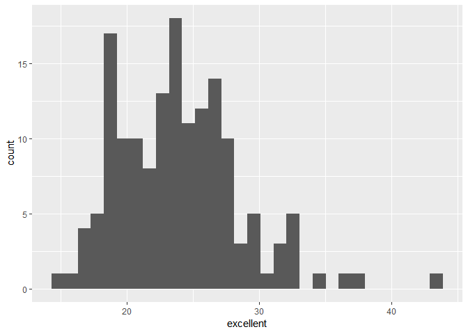

P8105\_HW2\_bjl2150
================
Briana Lettsome
October 5th, 2018

Problem 1
=========

``` r
# Reading in the NYC transit csv file plus cleaning the data

nyc_transit = read_csv(file = "./data/NYC_Transit_Subway_Entrance_And_Exit_Data.csv") %>%
  janitor::clean_names()
```

    ## Parsed with column specification:
    ## cols(
    ##   .default = col_character(),
    ##   `Station Latitude` = col_double(),
    ##   `Station Longitude` = col_double(),
    ##   Route8 = col_integer(),
    ##   Route9 = col_integer(),
    ##   Route10 = col_integer(),
    ##   Route11 = col_integer(),
    ##   ADA = col_logical(),
    ##   `Free Crossover` = col_logical(),
    ##   `Entrance Latitude` = col_double(),
    ##   `Entrance Longitude` = col_double()
    ## )

    ## See spec(...) for full column specifications.

``` r
# Removing the not requested variables
  
nyc_transit_clean = select(nyc_transit, -exit_only, -staffing, -staff_hours, -ada_notes, 
                           -free_crossover, -north_south_street, -east_west_street, 
                           -corner, -entrance_latitude, -entrance_longitude, 
                           -station_location, -entrance_location)%>%
      mutate(entry = recode(entry, YES = TRUE, NO = FALSE))

# Obtaining the dimension (rows X columns) of the datafile NYC_Transit_clean

dim(nyc_transit_clean)
```

    ## [1] 1868   20

Paragraph

``` r
# Question 1: Distinct function

 distinct(nyc_transit_clean, station_name, line)
```

    ## # A tibble: 465 x 2
    ##    line     station_name            
    ##    <chr>    <chr>                   
    ##  1 4 Avenue 25th St                 
    ##  2 4 Avenue 36th St                 
    ##  3 4 Avenue 45th St                 
    ##  4 4 Avenue 53rd St                 
    ##  5 4 Avenue 59th St                 
    ##  6 4 Avenue 77th St                 
    ##  7 4 Avenue 86th St                 
    ##  8 4 Avenue 95th St                 
    ##  9 4 Avenue 9th St                  
    ## 10 4 Avenue Atlantic Av-Barclays Ctr
    ## # ... with 455 more rows

There are 465 distinct stations.

``` r
# Question 2: ADA compliance

filter(nyc_transit_clean, ada == TRUE) %>%
distinct(station_name, line, ada = TRUE)
```

    ## # A tibble: 84 x 3
    ##    line            station_name                   ada  
    ##    <chr>           <chr>                          <lgl>
    ##  1 4 Avenue        Atlantic Av-Barclays Ctr       TRUE 
    ##  2 4 Avenue        DeKalb Av                      TRUE 
    ##  3 4 Avenue        Pacific St                     TRUE 
    ##  4 42nd St Shuttle Grand Central                  TRUE 
    ##  5 6 Avenue        34th St                        TRUE 
    ##  6 6 Avenue        47-50th Sts Rockefeller Center TRUE 
    ##  7 6 Avenue        Church Av                      TRUE 
    ##  8 63rd Street     21st St                        TRUE 
    ##  9 63rd Street     Lexington Av                   TRUE 
    ## 10 63rd Street     Roosevelt Island               TRUE 
    ## # ... with 74 more rows

There are 84 stations that are ADA compliant.

``` r
# Question 3: Proportion


filter(nyc_transit_clean, vending == "NO") %>%
nrow()
```

    ## [1] 183

``` r
filter(nyc_transit_clean, entry == "TRUE", vending == "NO") %>%
nrow()
```

    ## [1] 69

``` r
# Gathering route columns to make a tidier dataset

nyc_transit_tidy =
  gather(nyc_transit_clean, key = "route_number", value = "route_name", route1:route11) 

## Determining distinct stations that serve A train

filter(nyc_transit_tidy, route_name == "A") %>%
distinct(station_name, line, route_name = "A")
```

    ## # A tibble: 60 x 3
    ##    line            station_name                  route_name
    ##    <chr>           <chr>                         <chr>     
    ##  1 42nd St Shuttle Times Square                  A         
    ##  2 8 Avenue        125th St                      A         
    ##  3 8 Avenue        145th St                      A         
    ##  4 8 Avenue        14th St                       A         
    ##  5 8 Avenue        168th St - Washington Heights A         
    ##  6 8 Avenue        175th St                      A         
    ##  7 8 Avenue        181st St                      A         
    ##  8 8 Avenue        190th St                      A         
    ##  9 8 Avenue        34th St                       A         
    ## 10 8 Avenue        42nd St                       A         
    ## # ... with 50 more rows

There are 60 distinct stations that served the A train.

``` r
# Determining ADA compliance

filter(nyc_transit_tidy, route_name == "A", ada == TRUE) %>%
distinct(station_name, line, ada = TRUE)
```

    ## # A tibble: 17 x 3
    ##    line             station_name                  ada  
    ##    <chr>            <chr>                         <lgl>
    ##  1 8 Avenue         14th St                       TRUE 
    ##  2 8 Avenue         168th St - Washington Heights TRUE 
    ##  3 8 Avenue         175th St                      TRUE 
    ##  4 8 Avenue         34th St                       TRUE 
    ##  5 8 Avenue         42nd St                       TRUE 
    ##  6 8 Avenue         59th St                       TRUE 
    ##  7 8 Avenue         Inwood - 207th St             TRUE 
    ##  8 8 Avenue         West 4th St                   TRUE 
    ##  9 8 Avenue         World Trade Center            TRUE 
    ## 10 Broadway         Times Square-42nd St          TRUE 
    ## 11 Broadway-7th Ave 59th St-Columbus Circle       TRUE 
    ## 12 Broadway-7th Ave Times Square                  TRUE 
    ## 13 Canarsie         8th Av                        TRUE 
    ## 14 Franklin         Franklin Av                   TRUE 
    ## 15 Fulton           Euclid Av                     TRUE 
    ## 16 Fulton           Franklin Av                   TRUE 
    ## 17 Rockaway         Howard Beach                  TRUE

There are 17 distinct stations that are ADA compliant.

Problem 2
=========

Use of Mr. Trash Wheel excel dataset
------------------------------------

``` r
## Part 2 A

library(readxl)

## Importing and cleaning Mr. Trash Wheel excel file

trash_wheel = read_excel("./data/HealthyHarborWaterWheelTotals2018-7-28.xlsx", 
              sheet = "Mr. Trash Wheel")


trash_wheel = read_excel("./data/HealthyHarborWaterWheelTotals2018-7-28.xlsx", 
              sheet = "Mr. Trash Wheel", range = "A2:N336") %>% 
              janitor::clean_names() %>% 
              filter(dumpster != "N/A") %>% 
mutate(sports_balls = as.integer(sports_balls)) 
```

``` r
## Part 2B

## Reading in Trash Wheel, selecting in sheet "2016 Precipiation", and cleaning
library(readxl)

precip_16 = read_excel("./data/HealthyHarborWaterWheelTotals2018-7-28.xlsx", 
              sheet = "2016 Precipitation", range = "A2:B14") %>%
 janitor::clean_names() %>%
  mutate(year = 2016)


precip_17 = read_excel("./data/HealthyHarborWaterWheelTotals2018-7-28.xlsx", 
              sheet = "2017 Precipitation", range = "A2:B14") %>%
 janitor::clean_names() %>%
  mutate(year = 2017)

precipitation = bind_rows(precip_16, precip_17) %>%
   mutate(month = month.name[month])


# Calculating the total precipiation in 2017

total_precip = filter(precipitation, year == 2017)

summarize(total_precip, total = sum(total))
```

    ## # A tibble: 1 x 1
    ##   total
    ##   <dbl>
    ## 1  32.9

``` r
 # Calcuating the median number of sports balls in dumpster in 2016

sports_2016 = filter(trash_wheel, year == 2016)

median(sports_2016$sports_balls)
```

    ## [1] 26

Regarding these datasets, the Mr. Trash Wheel excel file was imported and the sheet, specifically focused on Mr. Trash Wheel, was selected for analysis. There were many variables retained, including dumpster number, weight of garbage in tons and numbers of sports balls and plastic bottles. The number ofobservations in the the dataset trash\_wheel was calculated to be 285, 14. They key variables of interest were

There are 24, 3 observations in the precipiation dataset. This dataset was created by merging the precip\_16 and precip\_17 datasets from the Mr. Trash Wheel excel file. The key variables in this particular data set are the months and years of precipiation as well as the toal amount of precipation 32.93. The median number of spors balls in a dumpster is 26.

Problem 3
=========

Importing, cleaning, filtering and tidying brfss\_smart2010 dataset
-------------------------------------------------------------------

``` r
# install.packages("devtools")

devtools::install_github("p8105/p8105.datasets")
```

    ## Skipping install of 'p8105.datasets' from a github remote, the SHA1 (21f5ad1c) has not changed since last install.
    ##   Use `force = TRUE` to force installation

``` r
library(p8105.datasets)
library(janitor)

data(brfss_smart2010)
  
brfss_smart2010 = brfss_smart2010 %>% 
  clean_names() %>%
  filter(topic == "Overall Health") %>%
select(-class, -topic, -question, -sample_size, 
       -(confidence_limit_low:geo_location))

brfss_spread = spread(brfss_smart2010, key = response, value = data_value) %>%
  janitor::clean_names() %>%
  mutate(proportion_reponse = (excellent + very_good))

# Determining how many unique locations in dataset

select(brfss_spread, locationdesc) %>%
sapply(function(locationdesc) length(unique(locationdesc)))
```

    ## locationdesc 
    ##          404

``` r
# Every represente state

select(brfss_spread, locationabbr) %>%
  distinct(locationabbr) %>%
  count()
```

    ## # A tibble: 1 x 1
    ##       n
    ##   <int>
    ## 1    51

``` r
count(brfss_spread, vars = locationabbr) %>% View


# Filtering year = 2002
brfss_spread_2 = filter(brfss_spread, year == 2002)

  
# Finding the median of the excellent responses
median(brfss_spread_2$excellent, na.rm = TRUE)
```

    ## [1] 23.6

Answering the Problem 3 questions
---------------------------------

1.  There are 404 unique locations included within this dataset.

-   1B. Every state is represented. There are total variables within the 'locationsabbr' column indicating that all states are represented plus an additional state, which is Washington, D.C.

-   1C. The state that is observed the most is New Jersey with 146 observations.

1.  23.6 is the median of the "Excellent" response values in 2002.

### Histogram of "Excellent" responses in 2002

``` r
ggplot(brfss_spread_2, aes(x = excellent)) + geom_histogram()
```

    ## `stat_bin()` using `bins = 30`. Pick better value with `binwidth`.

    ## Warning: Removed 2 rows containing non-finite values (stat_bin).



### Scatterplot of Queens and New York Counties

``` r
brfss_scatter = select(brfss_spread, excellent, locationdesc, year) %>%
    filter(locationdesc == "NY - Queens County") 
```
